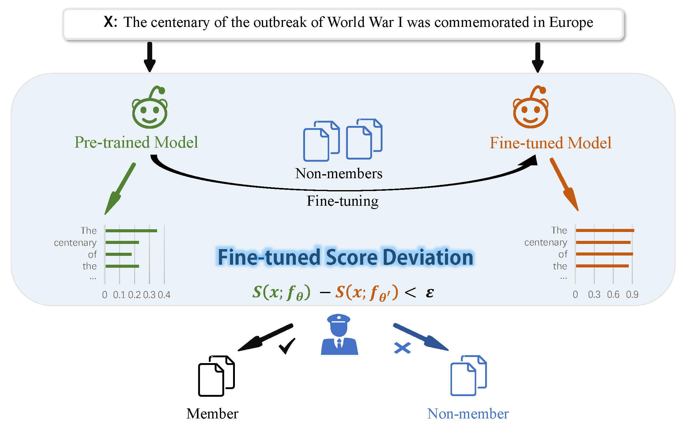

# Fine-tuning can Help Detect Pretraining Data from Large Language Models
This repository is the official implementation of [Fine-tuning can Help Detect Pretraining Data from Large Language Models](https://openreview.net/forum?id=X8dzvdkQwO) at ICLR 2025.

## Overview
In the era of large language models (LLMs), detecting pretraining data has been increasingly important due to concerns about fair evaluation and ethical risks. Current methods differentiate members and non-members by designing scoring functions, like Perplexity and Min-k%. However, the diversity and complexity of training data magnifies the difficulty of distinguishing, leading to suboptimal   performance in detecting pretraining data. In this paper, we first explore the benefits of unseen data, which can be easily collected after the release of the LLM. We find that the perplexities of LLMs shift differently for members and non-members, after fine-tuning with a small amount of previously unseen data. In light of this, we introduce a novel and effective method termed Fine-tuned Score Deviation(FSD), which improves the performance of current scoring functions for pretraining data detection. In particular, we propose to measure the deviation distance of current scores after fine-tuning on a small amount of unseen data within the same domain. In effect, using a few unseen data can largely decrease the scores of all non-members, leading to a larger deviation distance than members. Extensive experiments demonstrate the effectiveness of our method, significantly improving the AUC score on common benchmark datasets across various models.
<div align="center">
    
</div>

## Quick Start
**1. Installation**
```
conda env create -f environment.yaml
```

**2. Fine-tuning**   
Use the following command to fine-tune the model. The output of fine-tuning will be in the ``./checkpoint`` directory.
```
./run_sft.sh
```
**3. Evaluation**  
To evaluate our method, run:  
```
./run_eval.sh
```

## Citation
If you find our implementation and paper helpful, please consider citing our work:
```
@inproceedings{
zhang2025finetuning,
title={Fine-tuning can Help Detect Pretraining Data from Large Language Models},
author={Hengxiang Zhang and Songxin Zhang and Bingyi Jing and Hongxin Wei},
booktitle={The Thirteenth International Conference on Learning Representations},
year={2025},
url={https://openreview.net/forum?id=X8dzvdkQwO}
}
```

## Acknowledgements
Our code is inspired by [Min-K% Prob](https://github.com/swj0419/detect-pretrain-code). We thank the authors for releasing their code.